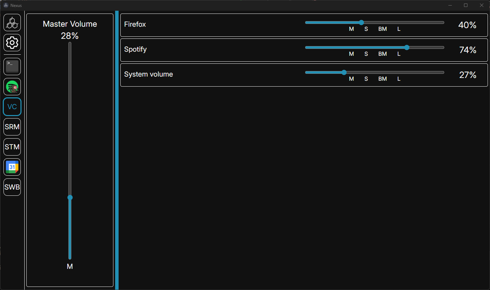

# Nexus: Volume Controller

**For Windows only**

A module for [Nexus](https://github.com/aarontburn/nexus-core) that adds a volume controller, very similar to the Windows system volume controller. 

## Installation
1. Download the latest release `.zip`. 
2. In Nexus, navigate to **Settings** > **Import Module**
3. Select the downloaded `.zip` file to install.

## Features
- Master volume control
- Individual process volume control
- Process mute
- Process solo (mute all except soloed process)
- Background mute (mute process when unfocused)

